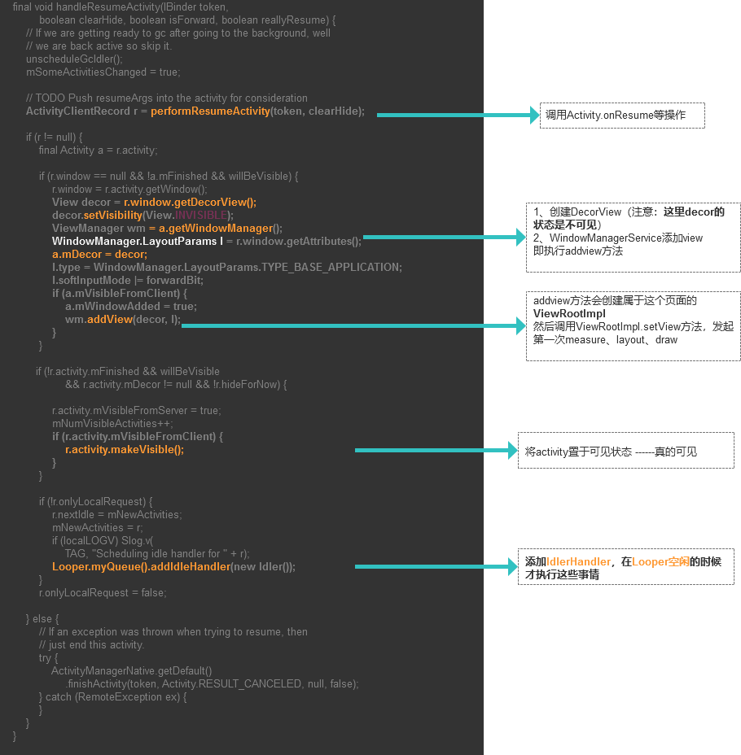
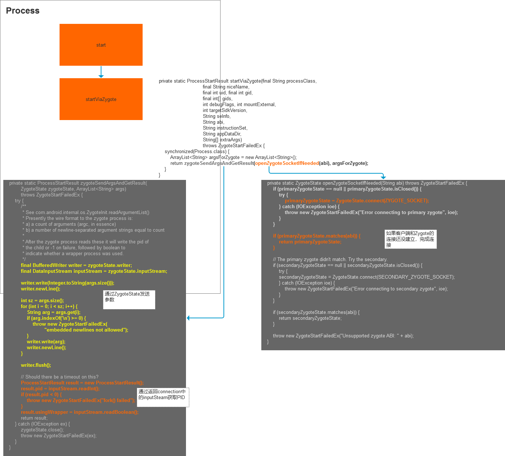

# Activity 启动流程

主要分为如下两个方面介绍：

1、Activity启动基本流程

2、Activity任务栈

## Activity启动基本流程

从Context发出startActivity指令到页面可见大抵会经过如下类：

**Instrumentation**:对外提供管理Activity接口        

**ActivityManagerService**（AMS）:系统服务，管理应用的Activity、Process、Service等

**ActivityStackSupervisor**:管理ActivityStack

**ActivityStack**:Activity任务栈

**ActivityThread**:应用进程


###### First Part 启动前的准备工作

startActivity有多个重载函数，最终都会调用这个重载函数

```java
public void startActivityForResult(Intent intent, int requestCode, @Nullable Bundle options) {
    if (mParent == null) {
        Instrumentation.ActivityResult ar =
            mInstrumentation.execStartActivity(
                this, mMainThread.getApplicationThread(), mToken, this,
                intent, requestCode, options);
        if (ar != null) {
            mMainThread.sendActivityResult(
                mToken, mEmbeddedID, requestCode, ar.getResultCode(),
                ar.getResultData());
        }
    
    } else {
        if (options != null) {
            mParent.startActivityFromChild(this, intent, requestCode, options);
        } else {
            // Note we want to go through this method for compatibility with
            // existing applications that may have overridden it.
            mParent.startActivityFromChild(this, intent, requestCode);
        }
    }
}
```
无论是否有父级Activity最后都会调用到 **Instrumentation.execStartActivity**这个函数，该函数通过AIDL与AMS通信，并正式进入Activity启动流程。

```java
public ActivityResult execStartActivity(
        Context who, IBinder contextThread, IBinder token, Activity target,
        Intent intent, int requestCode, Bundle options) {
    IApplicationThread whoThread = (IApplicationThread) contextThread;
    Uri referrer = target != null ? target.onProvideReferrer() : null;
    if (referrer != null) {
        intent.putExtra(Intent.EXTRA_REFERRER, referrer);
    }
    try {
        intent.migrateExtraStreamToClipData();
        intent.prepareToLeaveProcess();
        int result = ActivityManagerNative.getDefault()
            .startActivity(whoThread, who.getBasePackageName(), intent,
                    intent.resolveTypeIfNeeded(who.getContentResolver()),
                    token, target != null ? target.mEmbeddedID : null,
                    requestCode, 0, null, options);
        checkStartActivityResult(result, intent);
    } catch (RemoteException e) {
        throw new RuntimeException("Failure from system", e);
    }
    return null;
}
```
ActivityManagerService并不直接负责拉起Activity(毕竟是一个系统级的老大)，它提供了调用其他服务的入口，并转发相关请求。

```java
public final int startActivityAsUser(IApplicationThread caller, String callingPackage,
        Intent intent, String resolvedType, IBinder resultTo, String resultWho, int requestCode,
        int startFlags, ProfilerInfo profilerInfo, Bundle options, int userId) {
    enforceNotIsolatedCaller("startActivity");
    userId = handleIncomingUser(Binder.getCallingPid(), Binder.getCallingUid(), userId,
            false, ALLOW_FULL_ONLY, "startActivity", null);
    // TODO: Switch to user app stacks here.
    return mStackSupervisor.startActivityMayWait(caller, -1, callingPackage, intent,
            resolvedType, null, null, resultTo, resultWho, requestCode, startFlags,
            profilerInfo, null, null, options, false, userId, null, null);
}
```
一个Activity要启动需要知道，启动之后位于哪个栈（Activity启动模式、Activity任务栈）。所以在真正拉起Activity之前，**ActivityStackSupervisor**会进行如下流程：

###### 1、对AMS加同步锁，通过PMS收集目标Activity的基本信息（startActivityMayWait）

###### 2、初步检查Activity是否可以启动，如果不可以返回相关错误（startActivityLocked）

###### 3、确定在哪个栈（启动的时候携带的Flag，例如NEW_TASK会在这里判断并得出最终

###### 目标Activity所在的栈），分发到相应栈开启Activity（startActivityUncheckedLocked）

在确定Activity可以启动且查找到应该在的任务栈之后，ActivityStack会通过启动传入的标志位（如NEW_TASK等）调整ActivityRecord在TaskRecord中的位置。

最终会调用到ActivityStack的resumeTopActivityInnerLocked：

```java
private boolean resumeTopActivityInnerLocked(ActivityRecord prev, Bundle options) {

    final ActivityRecord next = topRunningActivityLocked(null);

    try {
        AppGlobals.getPackageManager().setPackageStoppedState(
                next.packageName, false, next.userId); /* TODO: Verify if correct userid */
    } catch (RemoteException e1) {
    } catch (IllegalArgumentException e) {
        Slog.w(TAG, "Failed trying to unstop package "
                + next.packageName + ": " + e);
    }

    ActivityStack lastStack = mStackSupervisor.getLastStack();
    if (next.app != null && next.app.thread != null) {
        //ActivityRecord在创建的时候并不会指定其所在的进程（ProcessRecord）,
        //只有在第一次开启了对应的activity之后才会指定所在进程；
        //所以这也是如何判断Activity是否直接resume的标志
        updateLRUListLocked(next);
        mService.updateOomAdjLocked();

        try {
            next.app.thread.scheduleResumeActivity(next.appToken, next.app.repProcState,
                    mService.isNextTransitionForward(), resumeAnimOptions);
            mStackSupervisor.checkReadyForSleepLocked();

            if (DEBUG_STATES) Slog.d(TAG_STATES, "resumeTopActivityLocked: Resumed " + next);
        } catch (Exception e) {
           
            return true;
        }

        // From this point on, if something goes wrong there is no way
        // to recover the activity.
        try {
            next.visible = true;
            completeResumeLocked(next);
        } catch (Exception e) {
            // If any exception gets thrown, toss away this
            // activity and try the next one.
            Slog.w(TAG, "Exception thrown during resume of " + next, e);
            requestFinishActivityLocked(next.appToken, Activity.RESULT_CANCELED, null,
                    "resume-exception", true);
            if (DEBUG_STACK) mStackSupervisor.validateTopActivitiesLocked();
            return true;
        }
        next.stopped = false;

    } else {
       
        if (DEBUG_STATES) Slog.d(TAG_STATES, "resumeTopActivityLocked: Restarting " + next);
        mStackSupervisor.startSpecificActivityLocked(next, true, true);
    }
    //没有进程记录（即宿主APP的ProcessRecord），执行start流程
    if (DEBUG_STACK) mStackSupervisor.validateTopActivitiesLocked();
    return true;
}
```
该函数通过Activity是否包含宿主App的ProcessCord来判断是resume还是start。


###### Second Part 开始启动

从第一部分末尾我们可以知道，所有Activity最终的启动发起是交给ActivityStackSupervisor.startSpecificActivityLocked来完成的。

```java
void startSpecificActivityLocked(ActivityRecord r,
        boolean andResume, boolean checkConfig) {
    // Is this activity's application already running?
    //检查activity所在的应用是否有进程记录
    ProcessRecord app = mService.getProcessRecordLocked(r.processName,
            r.info.applicationInfo.uid, true);

    r.task.stack.setLaunchTime(r);
    //如果有记录，说明已经拉起过，执行启动Activity流程
    if (app != null && app.thread != null) {
        try {
            if ((r.info.flags&ActivityInfo.FLAG_MULTIPROCESS) == 0
                    || !"android".equals(r.info.packageName)) {
                // Don't add this if it is a platform component that is marked
                // to run in multiple processes, because this is actually
                // part of the framework so doesn't make sense to track as a
                // separate apk in the process.
                app.addPackage(r.info.packageName, r.info.applicationInfo.versionCode,
                        mService.mProcessStats);
            }
            realStartActivityLocked(r, app, andResume, checkConfig);
            return;
        } catch (RemoteException e) {
            Slog.w(TAG, "Exception when starting activity "
                    + r.intent.getComponent().flattenToShortString(), e);
        }

        // If a dead object exception was thrown -- fall through to
        // restart the application.
    }
    //没有进程记录，应该先拉起对应的Application
    mService.startProcessLocked(r.processName, r.info.applicationInfo, true, 0,
            "activity", r.intent.getComponent(), false, false, true);
}
```
来到最后一个函数realStartActivityLocked（从名字也可以看出是最后的流程）：

```java
final boolean realStartActivityLocked(ActivityRecord r,
        ProcessRecord app, boolean andResume, boolean checkConfig)
        throws RemoteException {
    //...
    mService.updateLruProcessLocked(app, true, null);
    mService.updateOomAdjLocked();

    final TaskRecord task = r.task;
    if (task.mLockTaskAuth == LOCK_TASK_AUTH_LAUNCHABLE ||
            task.mLockTaskAuth == LOCK_TASK_AUTH_LAUNCHABLE_PRIV) {
        setLockTaskModeLocked(task, LOCK_TASK_MODE_LOCKED, "mLockTaskAuth==LAUNCHABLE", false);
    }

    final ActivityStack stack = task.stack;
    try {
        if (app.thread == null) {
            throw new RemoteException();
        }
        //...
        app.forceProcessStateUpTo(mService.mTopProcessState);
        app.thread.scheduleLaunchActivity(new Intent(r.intent), r.appToken,
                System.identityHashCode(r), r.info, new Configuration(mService.mConfiguration),
                new Configuration(stack.mOverrideConfig), r.compat, r.launchedFromPackage,
                task.voiceInteractor, app.repProcState, r.icicle, r.persistentState, results,
                newIntents, !andResume, mService.isNextTransitionForward(), profilerInfo);
        //...
    } catch (RemoteException e) {
        if (r.launchFailed) {
            // This is the second time we failed -- finish activity
            // and give up.
            Slog.e(TAG, "Second failure launching "
                  + r.intent.getComponent().flattenToShortString()
                  + ", giving up", e);
            mService.appDiedLocked(app);
            stack.requestFinishActivityLocked(r.appToken, Activity.RESULT_CANCELED, null,
                    "2nd-crash", false);
            return false;
        }

        // This is the first time we failed -- restart process and
        // retry.
        app.activities.remove(r);
        throw e;
    }
    //...

    return true;
}
```

可以看出，每次启动Activity，都会触发AMS更新进程优先级以及Lru记录。

最终启动工作是交由Application的主进程ActivityThread.handleLaunchActivity来完成的（实际上是先通过AIDL发送到ApplicationThread，再转发到ActivityThread的）。

```java
private void handleLaunchActivity(ActivityClientRecord r, Intent customIntent) {
    // If we are getting ready to gc after going to the background, well
    // we are back active so skip it.
    unscheduleGcIdler();
    //...
    Activity a = performLaunchActivity(r, customIntent);

    if (a != null) {
        r.createdConfig = new Configuration(mConfiguration);
        Bundle oldState = r.state;
        handleResumeActivity(r.token, false, r.isForward,
                !r.activity.mFinished && !r.startsNotResumed);

        //...
            r.paused = true;
        }
    } else {
        // If there was an error, for any reason, tell the activity
        // manager to stop us.
        try {
            ActivityManagerNative.getDefault()
                .finishActivity(r.token, Activity.RESULT_CANCELED, null, false);
        } catch (RemoteException ex) {
            // Ignore
        }
    }
}
```

该函数主要执行两个流程：

###### performLaunchActivity()；

1、**使用ClassLoader加载并创建对应的Activity**
2、通过**ActivityClientRecord中的LoadApk创建Application**(makeApplication函数 -----> 如果创建了那么直接返回；如果没有，创建AppContext以及Application)
3、**创建Activity的baseContext**
4、**执行Activity.attatch   真正的Activity参数初始化方法**
5、Instrumentation通知Activity.onCreate
6、Activity执行performStart完成部分初始化，同样由Instrumentation通知Activity.onStart

###### handleResumeActivity();



至此，Activity启动基本完成。

#### 启动入口Activity有哪些区别？

在Activity启动的第二部分开始，我们知道ActivityStackSupervisor.startSpecificActivityLocked中会通过AMS中是否存在进程记录来判断应用是否启动，如果没有启动，那么调用**AMS.startProcessLocked先fork出对应进程**

###### 注意：实际上调用了多个重载函数，代码有精简

```java
private final void startProcessLocked(ProcessRecord app, String hostingType,
        String hostingNameStr, String abiOverride, String entryPoint, String[] entryPointArgs) {
    long startTime = SystemClock.elapsedRealtime();
    checkTime(startTime, "startProcess: starting to update cpu stats");
    updateCpuStats();
    checkTime(startTime, "startProcess: done updating cpu stats");
    try {
        int uid = app.uid;
        int[] gids = null;
        int mountExternal = Zygote.MOUNT_EXTERNAL_NONE;
        Process.ProcessStartResult startResult = Process.start(entryPoint,
                app.processName, uid, uid, gids, debugFlags, mountExternal,
                app.info.targetSdkVersion, app.info.seinfo, requiredAbi, instructionSet,
                app.info.dataDir, entryPointArgs);
        checkTime(startTime, "startProcess: returned from zygote!");
        Trace.traceEnd(Trace.TRACE_TAG_ACTIVITY_MANAGER);
    } catch (RuntimeException e) {
    }
}
```
Process大概流程如下图：



主要是通过Socket进行进程通信传递消息到ZygoteInit，然后由Zygote fork出进程。

而后会通过反射调用到ActivityThread.main()创建新的应用主进程，其中ActivityThread.attatch()会调用到AMS.attachApplicationLocked进而创建对应进程的ProcessRecord，创建之后会检查是否有Activity需要拉起，从而，拉起根Activity。

#### Window何时创建？

在ActivityThread.performLaunchActivity()中有一个步骤是调用

**Activity.attatch()**初始化Activity的Context以及其他参数，这里就包含对PhoneWindow的创建并加入到WindowManagerService。

#### DecorView何时创建，并开始第一次绘制？

在ActivityThread.handleResumeActivity()中，

执行performResumeActivity之后，会从window中获取到DecorView，然后将decor加入到WindowManagerService中（WindowManagerService.addView ---> WindowManagerGlobal.addView）；

在**WindowManagerGlobal.addView：**

```java
public void addView(View view, ViewGroup.LayoutParams params,
        Display display, Window parentWindow) {
    //...
    ViewRootImpl root;
    View panelParentView = null;
    //...
    synchronized (mLock) {
        // Start watching for system property changes.
        if (mSystemPropertyUpdater == null) {
            mSystemPropertyUpdater = new Runnable() {
                @Override public void run() {
                    synchronized (mLock) {
                        for (int i = mRoots.size() - 1; i >= 0; --i) {
                            mRoots.get(i).loadSystemProperties();
                        }
                    }
                }
            };
            SystemProperties.addChangeCallback(mSystemPropertyUpdater);
        }
        //...
        //创建绘制的时候根View
        root = new ViewRootImpl(view.getContext(), display);

        view.setLayoutParams(wparams);

        mViews.add(view);
        mRoots.add(root);
        mParams.add(wparams);
    }

    // do this last because it fires off messages to start doing things
    try {
        //调用setView，触发第一次绘制并开始接收垂直同步消息
        root.setView(view, wparams, panelParentView);
    } catch (RuntimeException e) {
        // BadTokenException or InvalidDisplayException, clean up.
        synchronized (mLock) {
            final int index = findViewLocked(view, false);
            if (index >= 0) {
                removeViewLocked(index, true);
            }
        }
        throw e;
    }
}
```

所以，**所有元素开始可见是在Activity.onResume之后**


## Activity任务栈

管理ActivityRecord的终极老大是ActivityStackSupervisor，它包含两个基本的ActivityStack.

###### 实际上Android 4.4以前只有一个mHistory 来管理所有的 activity；在后期，芯片厂商为了增加新feature有可能在这里新增一个或者多个栈，比如Multi-window的实现，所以才新增了ActivityStackSupervisor并变更为新的栈管理架构。

其他的基本对应关系如下：

Activity          -------------------------           ActivityRecord

一个任务栈    -------------------------           TaskRecord


