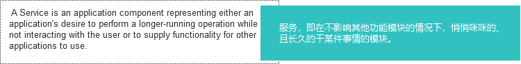
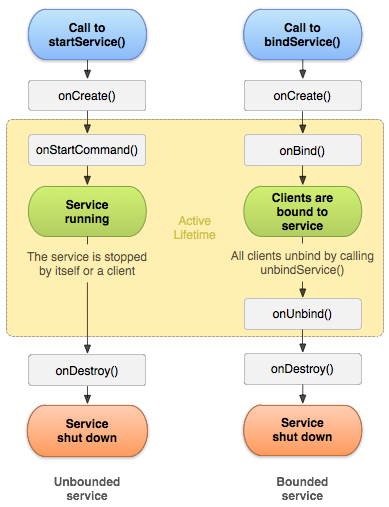
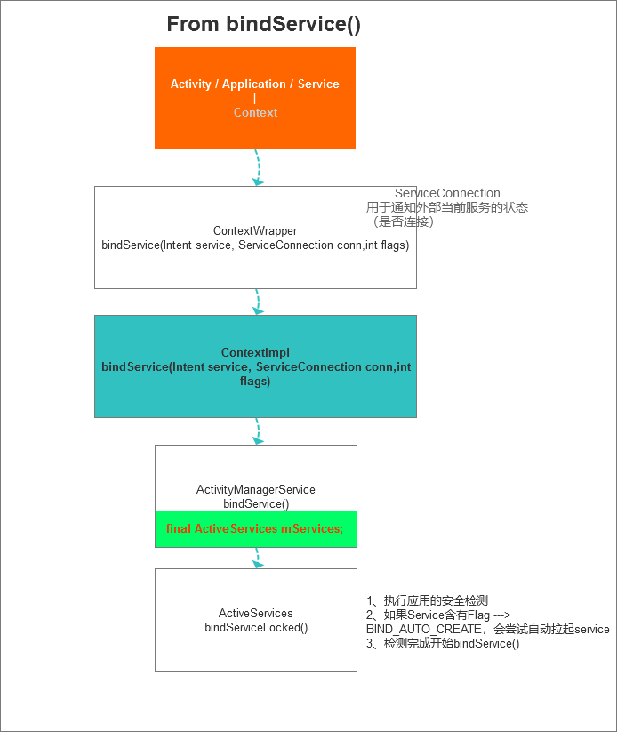
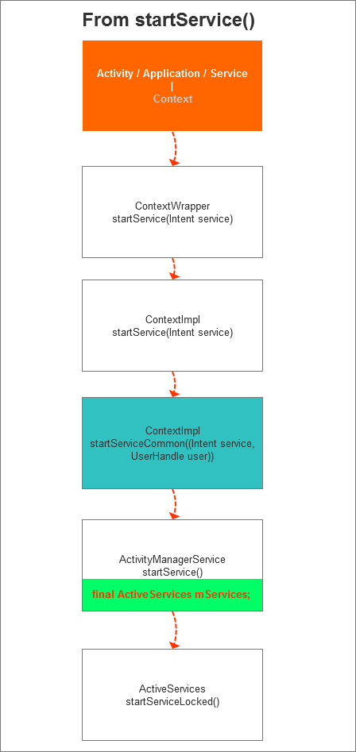
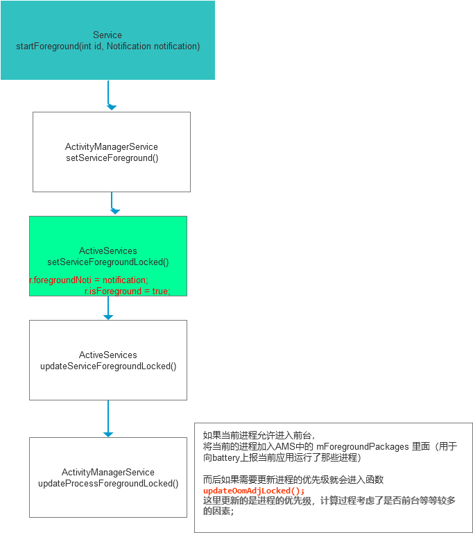
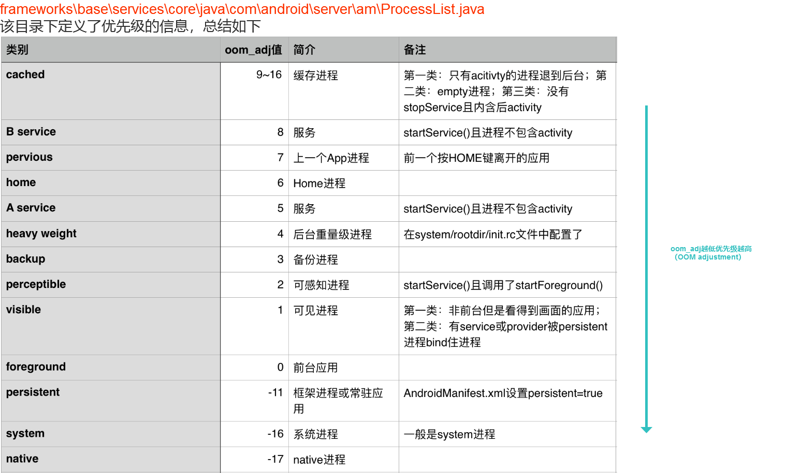

# Android Service源码浅析

[TOC]

## Service是什么

官方定义：



在Android里面，服务有两种存在的形式

1、**依托于其他组件存在**，例如：AIDL
这种服务在启动的时候会调用**bindService()**将指定的Context绑定到Service中（一个service允许绑定多个组件）
一旦Service中绑定的组件被清空，该服务就会被停止

2、**独立存在**，自己悄悄咪咪做一些事情的
这类服务启动的时候调用**startService()**启动，并调用stopSelf()或者stopService()停止服务

### Service生命周期

直接上官方的一张图：



*Tips*

*• 无论是那种方式结束Service, onDestory()都会被回调；*

   *同样，无论以哪种方式启动service，onCreate()都会回调*

*• Service只要没有指定运行的process都是运行在主线程*

*• 通过startService启动的服务依然可以调用bindService绑定组件*

## Service如何创建

从上面生命周期以及Service简介中，我们知道启动服务有两种方式

1、bindService()

2、startService()

下面会从源码(API 28)来分析这两种方式的差异

#### bindService() 方法调用链



#### startService() 方法调用链



可以看出最终start或者bind的任务都是交到AMS中的ActiveServices执行的，

#### bindService到底和startService到底有什么区别呢？

------

##### 先看startService的核心代码： ActiveServices.java

``` java
ComponentName startServiceLocked(IApplicationThread caller, Intent service, String resolvedType,
        int callingPid, int callingUid, String callingPackage, int userId)
        throws TransactionTooLargeException {
    if (DEBUG_DELAYED_STARTS) Slog.v(TAG_SERVICE, "startService: " + service
            + " type=" + resolvedType + " args=" + service.getExtras());

    final boolean callerFg;
    if (caller != null) {
        final ProcessRecord callerApp = mAm.getRecordForAppLocked(caller);
        if (callerApp == null) {
            throw new SecurityException(
                    "Unable to find app for caller " + caller
                    + " (pid=" + Binder.getCallingPid()
                    + ") when starting service " + service);
        }
        callerFg = callerApp.setSchedGroup != Process.THREAD_GROUP_BG_NONINTERACTIVE;
    } else {
        callerFg = true;
    }

    //创建ServiceRecord
    ServiceLookupResult res =
        retrieveServiceLocked(service, resolvedType, callingPackage,
                callingPid, callingUid, userId, true, callerFg);
    if (res == null) {
        return null;
    }
    if (res.record == null) {
        return new ComponentName("!", res.permission != null
                ? res.permission : "private to package");
    }

    ServiceRecord r = res.record;
    //执行启动前的检查

    return startServiceInnerLocked(smap, service, r, callerFg, addToStarting);
}
```

```java
ComponentName startServiceInnerLocked(ServiceMap smap, Intent service, ServiceRecord r,
        boolean callerFg, boolean addToStarting) throws TransactionTooLargeException {
    ProcessStats.ServiceState stracker = r.getTracker();
    if (stracker != null) {
        stracker.setStarted(true, mAm.mProcessStats.getMemFactorLocked(), r.lastActivity);
    }
    r.callStart = false;
    synchronized (r.stats.getBatteryStats()) {
        r.stats.startRunningLocked();
    }
    //调用bringUpServiceLocked拉起对应service
    String error = bringUpServiceLocked(r, service.getFlags(), callerFg, false);
   //...
    return r.name;
}
```

概括起来分为3步：

1. 为启动的Service创建ServiceRecord
2. 执行启动前的一系列检查
3. 含有**BIND_AUTO_CREATE**标记，调用**bringUpServiceLocked()**执行最终的拉起操作

------

##### bindService()核心代码   ActiveServices.java

```java
int bindServiceLocked(IApplicationThread caller, IBinder token, Intent service,
        String resolvedType, IServiceConnection connection, int flags,
        String callingPackage, int userId) throws TransactionTooLargeException {
    if (DEBUG_SERVICE) Slog.v(TAG_SERVICE, "bindService: " + service
            + " type=" + resolvedType + " conn=" + connection.asBinder()
            + " flags=0x" + Integer.toHexString(flags));
    final ProcessRecord callerApp = mAm.getRecordForAppLocked(caller);
    if (callerApp == null) {
        throw new SecurityException(
                "Unable to find app for caller " + caller
                + " (pid=" + Binder.getCallingPid()
                + ") when binding service " + service);
    }
    //根据传入的token，从ActivityStack中获取对应的ActivityRecord
    ActivityRecord activity = null;
    if (token != null) {
        activity = ActivityRecord.isInStackLocked(token);
        if (activity == null) {
            Slog.w(TAG, "Binding with unknown activity: " + token);
            return 0;
        }
    }

    final boolean callerFg = callerApp.setSchedGroup != Process.THREAD_GROUP_BG_NONINTERACTIVE;
    //创建对应的ServiceRecord
    ServiceLookupResult res =
        retrieveServiceLocked(service, resolvedType, callingPackage,
                Binder.getCallingPid(), Binder.getCallingUid(), userId, true, callerFg);
    if (res == null) {
        return 0;
    }
    if (res.record == null) {
        return -1;
    }
    ServiceRecord s = res.record;

    final long origId = Binder.clearCallingIdentity();

    try {


        mAm.startAssociationLocked(callerApp.uid, callerApp.processName,
                s.appInfo.uid, s.name, s.processName);
        //建立ConnectionRecord
        AppBindRecord b = s.retrieveAppBindingLocked(service, callerApp);
        ConnectionRecord c = new ConnectionRecord(b, activity,
                connection, flags, clientLabel, clientIntent);

        IBinder binder = connection.asBinder();
        ArrayList<ConnectionRecord> clist = s.connections.get(binder);
        if (clist == null) {
            clist = new ArrayList<ConnectionRecord>();
            s.connections.put(binder, clist);
        }
        clist.add(c);
        b.connections.add(c);
        //添加ConnectionRecord到Activity.connections中
        //Activity会在被ActivityStack移除的时候调用ActiveServices.removeConnectionLocked
        //清理相关Connection并完成生命周期的同步
        if (activity != null) {
            if (activity.connections == null) {
                activity.connections = new HashSet<ConnectionRecord>();
            }
            activity.connections.add(c);
        }
        b.client.connections.add(c);
        if ((c.flags&Context.BIND_ABOVE_CLIENT) != 0) {
            b.client.hasAboveClient = true;
        }
        if (s.app != null) {
            updateServiceClientActivitiesLocked(s.app, c, true);
        }
        //添加传入的Connection到ActiveServices中
        clist = mServiceConnections.get(binder);
        if (clist == null) {
            clist = new ArrayList<ConnectionRecord>();
            mServiceConnections.put(binder, clist);
        }
        clist.add(c);

        if ((flags&Context.BIND_AUTO_CREATE) != 0) {
            s.lastActivity = SystemClock.uptimeMillis();
            if (bringUpServiceLocked(s, service.getFlags(), callerFg, false) != null) {
                return 0;
            }
        }

    } finally {
        Binder.restoreCallingIdentity(origId);
    }

    return 1;
}
```

概括起来可以分为以下4个步骤：

1. 获取需要bind的Activity对应的ActivityRecord
2. 创建对应的**ServiceRecrod**
3. 创建对应的**ConnectionRecord,并添加到ActivityRecord.connections**中，会在Activity被ActivityStack移除的时候调用ActiveServices.removeConnectionLocked清理相关Connection并完成生命周期的同步
4. 含有**BIND_AUTO_CREATE**标记，调用**bringUpServiceLocked()**执行最终的拉起操作

------

##### bindService和startService两种方式小结：

生命周期的区别:

1. bindService会**有bind以及unBind的回调，没有onStartCommand**回调，监听是否绑定是通过**IServiceConnection**完成的
2. startService会**有onStartCommand回调，没有绑定**相关回调

源码启动时候的区别：

1. startService就只会有创建ServiceRecord的逻辑，没有其他特殊逻辑
2. bindService因为需要bind到对应Activity，所以多一个**建立连接（ConnectionRecord）并和ActivityRecord建立关系**<!--添加到ActivityRecord.connections-->的逻辑

## 如何设置为前台服务

调用函数Service.startForeground(int id, Notification notification)就可以将Service设置为前台服务。

<!--Tip:API 24之后setForeground(boolean isForeground)已经废弃，取而代之的是startForeground(int id, Notification notification)强制要求传入一个前台弹窗，这样前台应用也无法做到应用无感知了-->

调用setFpreground之后的方法调用链如下：



```java
final void updateProcessForegroundLocked(ProcessRecord proc, boolean isForeground,
        boolean oomAdj) {
    if (isForeground != proc.foregroundServices) {
        proc.foregroundServices = isForeground;
        ArrayList<ProcessRecord> curProcs = mForegroundPackages.get(proc.info.packageName,
                proc.info.uid);
        if (isForeground) {
            if (curProcs == null) {
                curProcs = new ArrayList<ProcessRecord>();
                mForegroundPackages.put(proc.info.packageName, proc.info.uid, curProcs);
            }
            if (!curProcs.contains(proc)) {
                curProcs.add(proc);
                mBatteryStatsService.noteEvent(BatteryStats.HistoryItem.EVENT_FOREGROUND_START,
                        proc.info.packageName, proc.info.uid);
            }
        } else {
            if (curProcs != null) {
                if (curProcs.remove(proc)) {
                    mBatteryStatsService.noteEvent(
                            BatteryStats.HistoryItem.EVENT_FOREGROUND_FINISH,
                            proc.info.packageName, proc.info.uid);
                    if (curProcs.size() <= 0) {
                        mForegroundPackages.remove(proc.info.packageName, proc.info.uid);
                    }
                }
            }
        }
        //更新进程优先级
        if (oomAdj) {
            updateOomAdjLocked();
        }
    }
}
```

## 进程优先级


